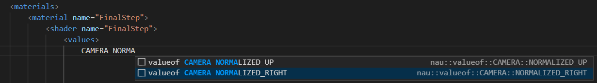
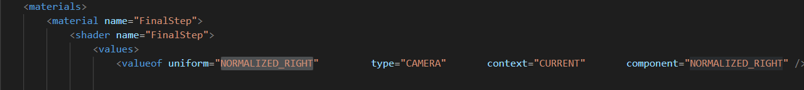

# NAU-3D_SNIPPETS
A repository of vscode user snippets for [NAU-3D](https://github.com/Nau3D/nau)

How to create user snippets: [Here](https://code.visualstudio.com/docs/editor/userdefinedsnippets#_create-your-own-snippets) 

Or insert the file in the .vscode folder in your project.

Some of the automated snippets might be missing fields. 

[NAU_COMPONENTS.json](NAU_COMPONENTS.json) is a json file extracted from the documentation -> [here](https://nau3d.di.uminho.pt/tutorial/specifying-objects-components-and-contexts/).

